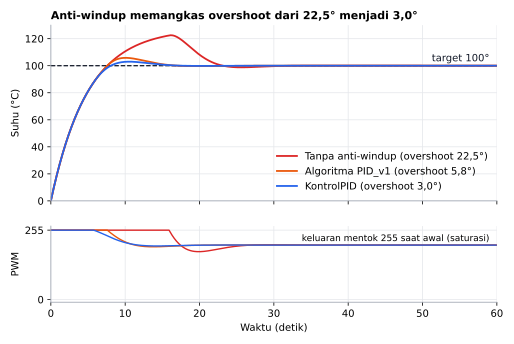
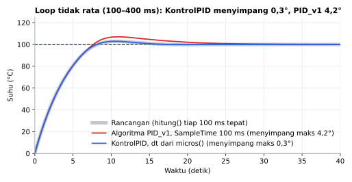
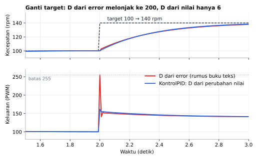

# KontrolPID

[English](README.en.md)

Library Arduino berbahasa Indonesia untuk **kontrol PID**: kecepatan motor, suhu, line follower, dan robot berbelok. Cukup satu baris, `pid.hitung(target, nilai)`, tanpa pointer dan tanpa `SetMode()`.

```cpp
KontrolPID pid(2.0, 0.5, 0.1);         // kp, ki, kd
float pwm = pid.hitung(target, nilai);
```

## Fitur

- **Langsung bekerja** setelah dibuat. Tidak perlu `SetMode(AUTOMATIC)` atau variabel pointer.
- **dt nyata dari `micros()`**: waktu antar-panggilan diukur, jadi I dan D tetap benar walau `loop()` kadang lambat. Punya timer sendiri? Pakai `hitung(target, nilai, dt)`.
- **Anti-windup**: integral berhenti menumpuk saat keluaran mentok di batas, sehingga lonjakan (overshoot) kecil.
- **Tanpa lonjakan saat target berubah**: D dihitung dari perubahan nilai, bukan dari error (*derivative on measurement*).
- **Filter D** opsional untuk sensor yang berderau (encoder kasar, sensor garis).
- **Ganti kp/ki/kd di tengah jalan** tanpa lonjakan dari integral. Cocok untuk tuning lewat Serial.
- **Perpindahan mulus dari kendali manual** lewat `reset(keluaranTerakhir)`.
- **Arah terbalik** untuk proses seperti pendingin (keluaran naik, nilai turun).
- **Komponen P, I, D bisa dibaca** untuk Serial Plotter.
- Aman saat `micros()` meluap (setiap ±71 menit). Memakai 50 byte RAM per pengendali.

## Board yang didukung

| Board | Teruji compile |
|---|---|
| Arduino Uno / Nano | ✅ |
| Arduino Mega | ✅ |
| ESP32 DevKit | ✅ |
| ESP32-C3 / S3 | ✅ |
| STM32 Blackpill F411 | ✅ |
| STM32 Bluepill F103 | ✅ |

Library ini hanya memakai `micros()` dan matematika `float`, jadi seharusnya bekerja di board Arduino lain juga.

## Instalasi

**Library Manager:** Arduino IDE → *Sketch → Include Library → Manage Libraries…* → cari **KontrolPID** → *Install*.

**Manual:** unduh ZIP dari GitHub → *Sketch → Include Library → Add .ZIP Library…*

## Contoh cepat

```cpp
#include <KontrolPID.h>

KontrolPID pid(2.0, 0.5, 0.1); // kp, ki, kd

void setup() {
  pid.aturBatas(0, 255);       // batas PWM
}

void loop() {
  static uint32_t terakhir = 0;
  if (millis() - terakhir < 20) return; // hitung tiap 20 ms
  terakhir += 20;

  float nilai = analogRead(A0);
  float pwm = pid.hitung(500, nilai);   // target 500
  analogWrite(9, (int)pwm);
}
```

Panggil `hitung()` dengan selang waktu yang kira-kira tetap (10–100 ms untuk motor, 0,5–1 detik untuk suhu). Selang tidak harus persis, karena dt diukur sendiri, tapi memanggil ribuan kali per detik membuat D sangat berderau.

## Hasil simulasi



Pemanas orde-1 (kp = 4, ki = 2, PWM 0–255). Selama keluaran mentok di 255, PID tanpa anti-windup terus menumpuk integral dan suhu lewat 22,5° di atas target. KontrolPID hanya 3,0°, algoritma PID_v1 5,8°.



Tuning sama, tapi `hitung()` dipanggil dengan selang acak 100–400 ms (misalnya `loop()` tersendat LCD atau Serial). KontrolPID memakai waktu yang benar-benar lewat, jadi responnya hampir sama dengan rancangan (selisih maks 0,3°). Algoritma PID_v1 (disalin dari `Compute()` versi 1.2.1) menghitung seolah selalu lewat 100 ms, sehingga integral turun lebih lambat dan overshoot membesar (selisih maks 4,2°).



Saat target melompat, D yang dihitung dari error melonjak sesaat (keluaran mentok 255 selama satu langkah), sedangkan D dari perubahan nilai tidak. Kecepatan motor hampir sama; yang berbeda adalah hentakan ke motor. Ini cara kerja *derivative on measurement*, yang juga dipakai PID_v1, QuickPID, dan FastPID.

Grafik dibuat dari simulasi di PC yang menjalankan kode library ini (`extras/simulasi`):

```sh
cd extras/simulasi
python gambar.py   # butuh g++ dan matplotlib
```

## Referensi fungsi

### Dasar

| Fungsi | Keterangan |
|---|---|
| `KontrolPID(float kp, float ki, float kd)` | Buat pengendali. |
| `float hitung(float target, float nilai)` | Hitung keluaran. dt diukur dengan `micros()`. Panggilan pertama (dan pertama setelah `reset()`) belum punya dt, jadi I dan D belum bekerja. |
| `float hitung(float target, float nilai, float dt)` | Sama, dt dalam detik dari timer sendiri. dt nol, negatif, atau NaN: integral dan D tidak berubah. |
| `bool aturBatas(float min, float maks)` | Batas keluaran, misalnya `0, 255` (PWM satu arah) atau `-255, 255` (motor dua arah). Default tanpa batas. `false` jika `min >= maks`. |
| `void reset(float keluaran = 0)` | Hapus integral dan riwayat D. Isi keluaran terakhir saat pindah dari kendali manual agar mulus. |

**Selalu panggil `aturBatas()`.** Tanpa batas, anti-windup tidak punya acuan dan integral bisa menumpuk.

### Pengaturan

| Fungsi | Keterangan |
|---|---|
| `void aturTuning(float kp, float ki, float kd)` | Ganti tuning kapan saja, tanpa lonjakan dari integral. |
| `void aturFilterD(float detik)` | Low-pass untuk D. Konstanta waktu dalam detik, `0` = mati (default). Mulai dari 2–5 kali selang `hitung()`. |
| `void aturTerbalik(bool terbalik)` | `true` untuk proses terbalik: keluaran naik membuat nilai turun (pendingin, kipas). |

### Untuk debug & Serial Plotter

| Fungsi | Keterangan |
|---|---|
| `float keluaran()` | Keluaran terakhir. |
| `float p()`, `i()`, `d()` | Komponen P, I, D dari perhitungan terakhir. |
| `float kp()`, `ki()`, `kd()` | Tuning yang sedang dipakai. |

## Cara tuning singkat

1. Mulai dengan `ki = 0` dan `kd = 0`.
2. Naikkan `kp` sampai nilai cepat mendekati target dan mulai sedikit berosilasi.
3. Tambah `kd` sampai osilasi teredam. Jika keluaran bergetar kasar, pasang `aturFilterD()`.
4. Tambah `ki` pelan-pelan sampai sisa error hilang.

Contoh `TuningLewatSerial` membuat langkah ini bisa dilakukan tanpa upload ulang.

## Contoh yang tersedia

*File → Examples → KontrolPID*

| Contoh | Isi |
|---|---|
| `SimulasiTanpaHardware` | Motor disimulasikan di board. Belajar efek kp, ki, kd di Serial Plotter tanpa hardware. |
| `TuningLewatSerial` | Ubah kp/ki/kd dari Serial Monitor, lihat P, I, D di Serial Plotter. Proses: rangkaian RC. |
| `KontrolKecepatanMotor` | RPM motor DC tetap walau beban berubah, dengan encoder. |
| `KontrolSuhu` | Pemanas + termistor NTC, dengan pengaman sensor lepas. |
| `LineFollowerPID` | Robot line follower 5 sensor. |

## Dibanding library lain

Dicek dari source code PID_v1 1.2.1 (br3ttb), QuickPID 3.1.9, dan FastPID (mike-matera):

| | KontrolPID | PID_v1 | QuickPID | FastPID |
|---|---|---|---|---|
| Langsung bekerja setelah dibuat | ✅ | perlu `SetMode(AUTOMATIC)` | perlu `SetMode()` | ✅ |
| Keluaran negatif tanpa pengaturan | ✅ | batas default 0–255 | batas default 0–255 | default 0–32767 |
| I dan D memakai waktu yang benar-benar lewat | ✅ | waktu sampling tetap | waktu sampling tetap | frekuensi tetap |
| Integral dibatasi oleh | keluaran mentok (conditional) + batas | batas keluaran | conditional (default) | rentang `int32` saja |
| D dari perubahan nilai | ✅ | ✅ | ✅ (default) | ✅ |
| Filter D | ✅ | ❌ | ❌ | ❌ |
| Tipe data | `float` | `double` lewat pointer | `float` lewat pointer | `int16_t` |

"Waktu sampling tetap" artinya `Compute()` hanya menghitung jika sudah lewat `SampleTime`, lalu mengalikan ki dan kd dengan `SampleTime`, bukan dengan waktu yang sebenarnya lewat. Jika `loop()` terlambat (misalnya 300 ms karena LCD atau Serial), I dan D dihitung seolah hanya lewat 100 ms.

Pengukuran overshoot di `extras/test` (pemanas orde-1, PWM 0–255, kp = 4, ki = 2, target 100 derajat):

| Algoritma | Overshoot |
|---|---|
| **KontrolPID** | **3,0 derajat** |
| PID_v1 (algoritmanya disalin ke uji, dt sama) | 5,8 derajat |
| Tanpa anti-windup | 22,5 derajat |

Pada plant integrator (posisi motor, keluaran ±100, target 500), overshoot KontrolPID 6,4 dibanding 230 tanpa anti-windup.

## Pengujian

Konvergensi, overshoot, batas keluaran, dt nol/negatif, derivative kick, ganti tuning, reset, arah terbalik, filter D, dan luapan `micros()` diuji otomatis di PC (`extras/test`) setiap ada perubahan:

```sh
cd extras/test
g++ -std=c++11 -I. -I../../src uji.cpp ../../src/KontrolPID.cpp -o uji && ./uji
```

## Status

Versi 1.0.0 sudah lolos uji logika otomatis (termasuk simulasi plant) dan compile di 7 board, tapi **belum diuji di hardware sungguhan**. Jika menemukan masalah, silakan buka *issue* di GitHub.

## Lisensi

MIT © 2026 Amadeo Wisesa. Lihat [LICENSE](LICENSE).
